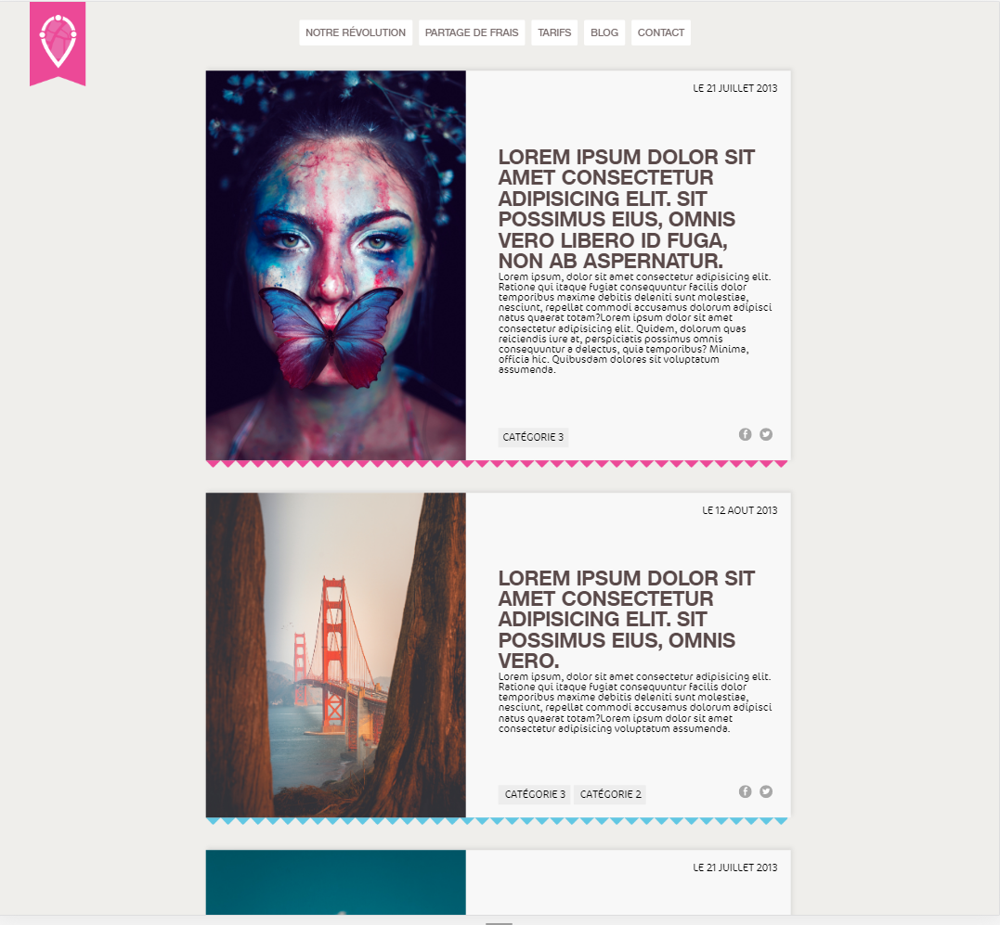
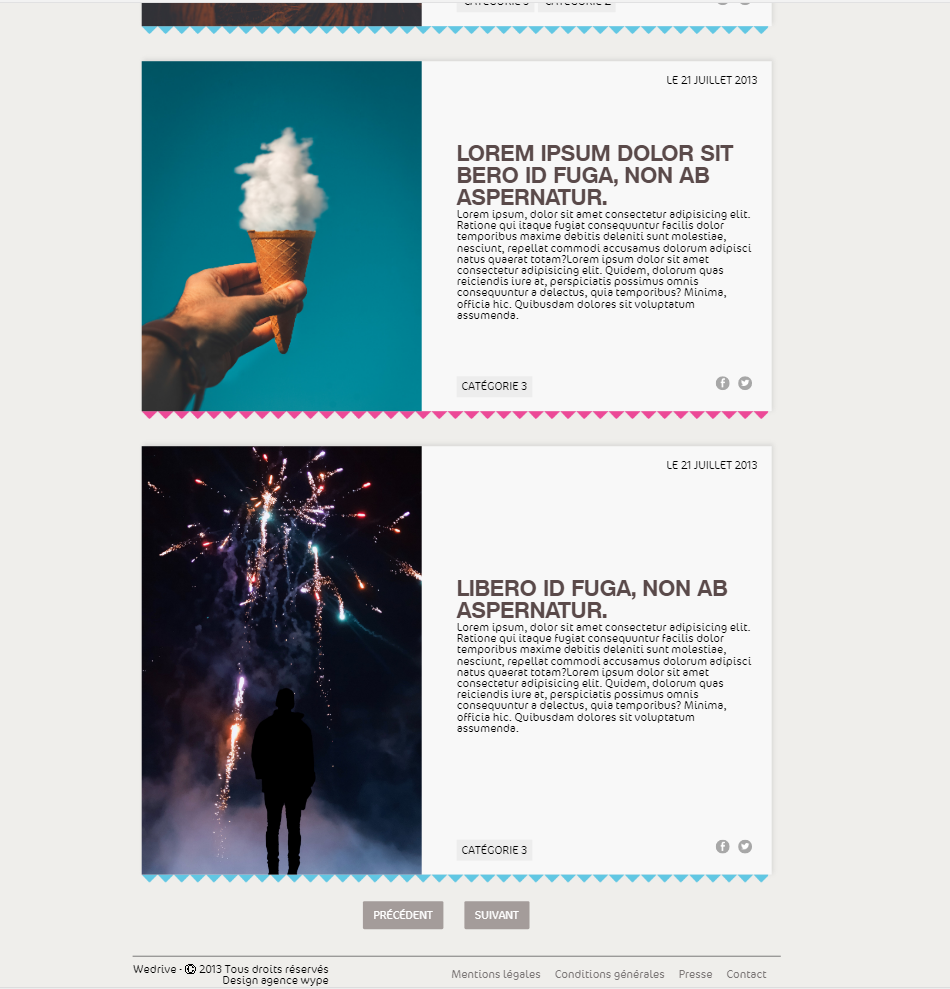

# Une intégration HTML / CSS

Réalisé en tout début de formation, l'objectif de cet exercice était de réaliser l'intégration d'un site internet en suivant trait pour trait l'image fournie ci dessous.

Un article sur deux, il fallait une déco rose et une déco bleue par exemple, l'état survolé des boutons et la disposition des élements. Le but était donc de travailler le CSS, le flex entre autre. 

Le résultat: 

